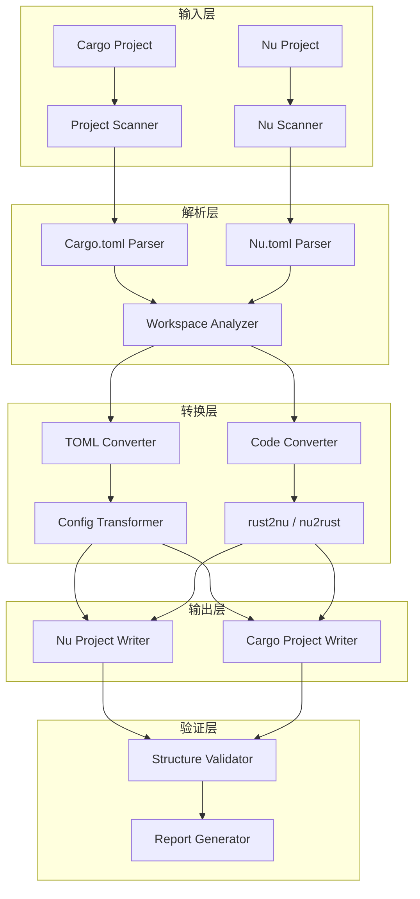
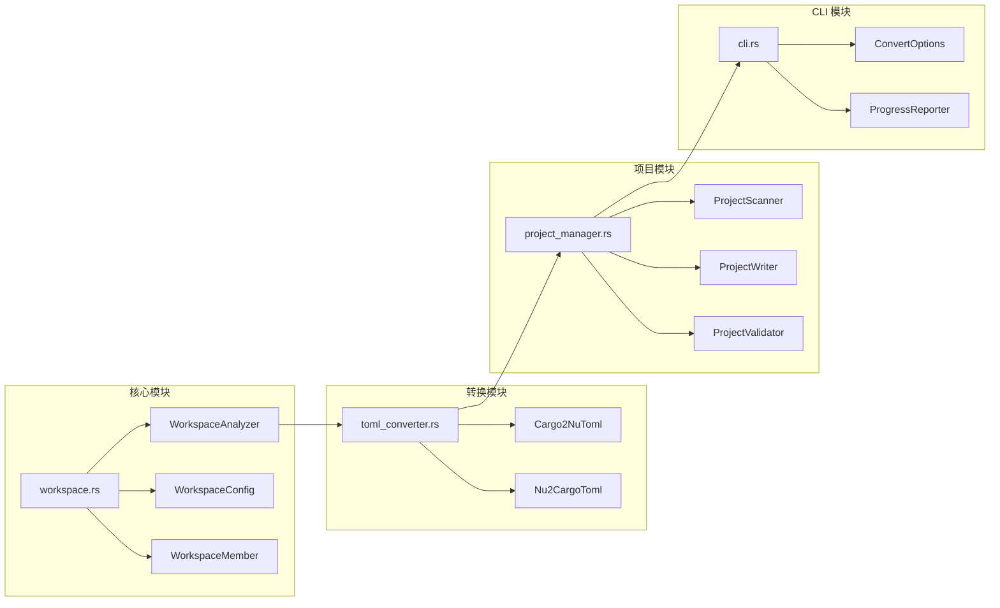

# Design Document: Cargo Workspace 完整支持

## Overview

本设计文档描述了 Nu 语言编译器中 `cargo2nu` 和 `nu2cargo` 工具对 Cargo Workspace 完整支持的技术架构和实现方案。

设计目标是实现一个健壮、可扩展的双向转换系统，能够处理复杂的 Rust 生态系统项目（如 serde、tokio、clap），同时保持代码的可维护性和测试覆盖率。

## Architecture

### 整体架构图



### 模块架构



## Components and Interfaces

### 1. WorkspaceConfig 数据结构

```rust
/// Workspace 配置的统一表示
pub struct WorkspaceConfig {
    /// Workspace 类型
    pub workspace_type: WorkspaceType,
    /// 成员列表（已展开 glob）
    pub members: Vec<String>,
    /// 排除列表
    pub exclude: Vec<String>,
    /// Resolver 版本
    pub resolver: Option<String>,
    /// Workspace 级别依赖
    pub dependencies: HashMap<String, DependencySpec>,
    /// Workspace 级别 package 配置
    pub package: Option<WorkspacePackage>,
    /// Workspace 元数据
    pub metadata: HashMap<String, toml::Value>,
    /// Workspace lints 配置
    pub lints: Option<WorkspaceLints>,
    /// Patch 配置
    pub patches: HashMap<String, HashMap<String, PatchSpec>>,
}

pub enum WorkspaceType {
    /// 仅包含 [workspace]，无 [package]
    Virtual,
    /// 同时包含 [workspace] 和 [package]
    Mixed,
    /// 单个项目，无 workspace
    Single,
}

pub struct WorkspaceMember {
    /// 成员相对路径
    pub path: PathBuf,
    /// 成员 Cargo.toml/Nu.toml 配置
    pub config: MemberConfig,
    /// 源文件列表
    pub source_files: Vec<SourceFile>,
    /// 特殊目录
    pub special_dirs: SpecialDirs,
}

pub struct SpecialDirs {
    pub tests: Option<PathBuf>,
    pub examples: Option<PathBuf>,
    pub benches: Option<PathBuf>,
    pub build_script: Option<PathBuf>,
}
```

### 2. WorkspaceAnalyzer 接口

```rust
pub trait WorkspaceAnalyzer {
    /// 分析项目根目录，返回 workspace 配置
    fn analyze(&self, root: &Path) -> Result<WorkspaceConfig>;
    
    /// 展开 glob 模式的成员路径
    fn expand_glob_members(&self, root: &Path, patterns: &[String]) -> Result<Vec<String>>;
    
    /// 验证成员路径有效性
    fn validate_members(&self, root: &Path, members: &[String]) -> Result<Vec<ValidationResult>>;
    
    /// 检测循环依赖
    fn detect_cycles(&self, config: &WorkspaceConfig) -> Result<Option<Vec<String>>>;
}

pub struct CargoWorkspaceAnalyzer;
pub struct NuWorkspaceAnalyzer;
```

### 3. TomlConverter 接口

```rust
pub trait TomlConverter {
    /// 转换 TOML 配置
    fn convert(&self, input: &str) -> Result<String>;
    
    /// 转换特定节
    fn convert_section(&self, section: &str, content: &toml::Value) -> Result<toml::Value>;
}

pub struct Cargo2NuTomlConverter {
    /// 节名映射表
    section_map: HashMap<&'static str, &'static str>,
    /// 键名映射表
    key_map: HashMap<&'static str, &'static str>,
}

pub struct Nu2CargoTomlConverter {
    section_map: HashMap<&'static str, &'static str>,
    key_map: HashMap<&'static str, &'static str>,
}
```

### 4. ProjectConverter 接口

```rust
pub trait ProjectConverter {
    /// 转换整个项目
    fn convert_project(&self, input: &Path, output: &Path, options: &ConvertOptions) -> Result<ConvertReport>;
    
    /// 转换单个成员
    fn convert_member(&self, member: &WorkspaceMember, output: &Path) -> Result<MemberReport>;
    
    /// 转换源文件
    fn convert_source_file(&self, input: &Path, output: &Path) -> Result<FileReport>;
}

pub struct ConvertOptions {
    /// 强制覆盖
    pub force: bool,
    /// 增量转换
    pub incremental: bool,
    /// 详细输出
    pub verbose: bool,
    /// 仅预览
    pub dry_run: bool,
    /// 排除模式
    pub exclude: Vec<String>,
    /// 仅包含成员
    pub only: Vec<String>,
}

pub struct ConvertReport {
    pub workspace_type: WorkspaceType,
    pub members_total: usize,
    pub members_converted: usize,
    pub files_total: usize,
    pub files_converted: usize,
    pub files_skipped: usize,
    pub files_failed: usize,
    pub warnings: Vec<String>,
    pub errors: Vec<String>,
}
```

## Data Models

### Nu.toml 格式规范

#### 节名映射表

| Cargo.toml | Nu.toml | 说明 |
|------------|---------|------|
| `[package]` | `[P]` | 包配置 |
| `[workspace]` | `[W]` | Workspace 配置 |
| `[dependencies]` | `[D]` | 依赖 |
| `[dev-dependencies]` | `[DD]` | 开发依赖 |
| `[build-dependencies]` | `[BD]` | 构建依赖 |
| `[workspace.dependencies]` | `[W.D]` | Workspace 依赖 |
| `[workspace.package]` | `[W.P]` | Workspace 包配置 |
| `[workspace.lints]` | `[W.lints]` | Workspace lints |
| `[workspace.lints.rust]` | `[W.lints.rust]` | Rust lints |
| `[workspace.lints.clippy]` | `[W.lints.clippy]` | Clippy lints |
| `[workspace.metadata.*]` | `[W.metadata.*]` | 元数据（保留） |
| `[lib]` | `[L]` | 库配置 |
| `[features]` | `[FE]` | Features |
| `[[bin]]` | `[[B]]` | 二进制目标 |
| `[[example]]` | `[[EX]]` | 示例 |
| `[[test]]` | `[[T]]` | 测试 |
| `[[bench]]` | `[[BE]]` | 基准测试 |
| `[profile.*]` | `[profile.*]` | Profile（保留） |
| `[patch.*]` | `[patch.*]` | Patch（保留） |
| `[target.*]` | `[target.*]` | Target（保留） |

#### 键名映射表

| Cargo.toml | Nu.toml | 说明 |
|------------|---------|------|
| `name` | `id` | 包名 |
| `version` | `v` | 版本 |
| `edition` | `ed` | Edition |
| `members` | `m` | 成员列表 |
| `exclude` | `ex` | 排除列表 |
| `resolver` | `r` | Resolver |
| `workspace` | `w` | Workspace 继承标记 |
| `authors` | `au` | 作者 |
| `description` | `desc` | 描述 |
| `license` | `lic` | 许可证 |
| `repository` | `repo` | 仓库 |
| `documentation` | `doc` | 文档 |
| `homepage` | `home` | 主页 |
| `readme` | `readme` | README（保留） |
| `keywords` | `kw` | 关键词 |
| `categories` | `cat` | 分类 |
| `default-features` | `df` | 默认 features |
| `optional` | `opt` | 可选依赖 |
| `path` | `path` | 路径（保留） |
| `git` | `git` | Git（保留） |
| `branch` | `branch` | 分支（保留） |
| `tag` | `tag` | 标签（保留） |
| `rev` | `rev` | 修订（保留） |

### 示例转换

#### 复杂 Workspace 示例

**Cargo.toml (输入)**
```toml
[workspace]
resolver = "2"
members = [
    "tokio",
    "tokio-macros",
    "tokio-test",
]
exclude = ["examples"]

[workspace.package]
version = "1.0.0"
edition = "2021"
license = "MIT"
repository = "https://github.com/tokio-rs/tokio"

[workspace.dependencies]
tokio = { version = "1.0", path = "tokio" }
syn = { version = "2.0", features = ["full"] }
quote = "1.0"

[workspace.lints.rust]
unexpected_cfgs = { level = "warn", check-cfg = ['cfg(tokio_unstable)'] }

[workspace.metadata.spellcheck]
config = "spellcheck.toml"

[patch.crates-io]
tokio = { path = "tokio" }
```

**Nu.toml (输出)**
```toml
[W]
r = "2"
m = [
    "tokio",
    "tokio-macros",
    "tokio-test",
]
ex = ["examples"]

[W.P]
v = "1.0.0"
ed = "2021"
lic = "MIT"
repo = "https://github.com/tokio-rs/tokio"

[W.D]
tokio = { v = "1.0", path = "tokio" }
syn = { v = "2.0", features = ["full"] }
quote = "1.0"

[W.lints.rust]
unexpected_cfgs = { level = "warn", check-cfg = ['cfg(tokio_unstable)'] }

[W.metadata.spellcheck]
config = "spellcheck.toml"

[patch.crates-io]
tokio = { path = "tokio" }
```

#### 成员包示例

**成员 Cargo.toml (输入)**
```toml
[package]
name = "tokio-macros"
version.workspace = true
edition.workspace = true
license.workspace = true

[lib]
proc-macro = true

[features]
default = []
full = ["rt-multi-thread"]
rt-multi-thread = []

[dependencies]
proc-macro2 = "1.0"
quote = { workspace = true }
syn = { workspace = true, features = ["full", "parsing"] }

[dev-dependencies]
tokio = { path = "../tokio", features = ["full"] }
```

**成员 Nu.toml (输出)**
```toml
[P]
id = "tokio-macros"
v.w = true
ed.w = true
lic.w = true

[L]
proc-macro = true

[FE]
default = []
full = ["rt-multi-thread"]
rt-multi-thread = []

[D]
proc-macro2 = "1.0"
quote = { w = true }
syn = { w = true, features = ["full", "parsing"] }

[DD]
tokio = { path = "../tokio", features = ["full"] }
```

## Correctness Properties

*A property is a characteristic or behavior that should hold true across all valid executions of a system-essentially, a formal statement about what the system should do. Properties serve as the bridge between human-readable specifications and machine-verifiable correctness guarantees.*


### Property 1: Workspace 类型识别正确性

*For any* 有效的 Cargo.toml 或 Nu.toml 文件，解析器 SHALL 正确识别其 workspace 类型（Virtual、Mixed 或 Single）。

**Validates: Requirements 1.1, 1.2, 1.3, 1.4**

### Property 2: 成员列表解析完整性

*For any* 包含 members 配置的 workspace 配置（无论单行或多行格式），解析器 SHALL 提取出完全相同的成员路径列表。

**Validates: Requirements 2.1, 2.2, 2.5**

### Property 3: TOML 节名双向转换一致性

*For any* Cargo.toml 中的节名，Cargo2Nu 转换后再用 Nu2Cargo 转换回来 SHALL 产生原始节名。映射关系包括：`[package]` ↔ `[P]`、`[workspace]` ↔ `[W]`、`[dependencies]` ↔ `[D]`、`[[bin]]` ↔ `[[B]]` 等。

**Validates: Requirements 3.1, 3.4, 4.4, 7.1, 7.2, 7.3, 7.4, 7.5, 7.6**

### Property 4: 键名双向转换一致性

*For any* Cargo.toml 中的键名，Cargo2Nu 转换后再用 Nu2Cargo 转换回来 SHALL 产生原始键名。映射关系包括：`name` ↔ `id`、`version` ↔ `v`、`members` ↔ `m`、`workspace` ↔ `w` 等。

**Validates: Requirements 2.3, 3.2, 3.3, 3.5, 4.1**

### Property 5: 依赖继承标记保留

*For any* 使用 `workspace = true` 继承的依赖配置，转换过程 SHALL 保留继承关系和所有附加属性（如 features、optional）。

**Validates: Requirements 3.2, 3.3, 3.5**

### Property 6: 路径依赖保留

*For any* 使用 `path = "..."` 的依赖配置，转换过程 SHALL 保留路径值不变。

**Validates: Requirements 5.1, 5.3, 5.4**

### Property 7: 保留节不变性

*For any* 标记为"保留"的节（如 `[profile.*]`、`[patch.*]`、`[target.*]`），转换过程 SHALL 保持其内容完全不变。

**Validates: Requirements 5.2, 7.7, 4.2**

### Property 8: 往返转换语义等价性

*For any* 有效的 Cargo workspace 项目，执行 Cargo → Nu → Cargo 往返转换后，生成的 Cargo.toml SHALL 与原始文件语义等价（解析后的数据结构相同）。

**Validates: Requirements 11.1, 11.2, 11.3**

### Property 9: 错误处理健壮性

*For any* 包含无效成员路径的 workspace 配置，转换器 SHALL 输出警告并继续处理有效成员，不应崩溃或静默失败。

**Validates: Requirements 8.1, 8.3**

### Property 10: 增量转换正确性

*For any* 启用增量模式的转换，当且仅当源文件修改时间晚于目标文件时，该文件 SHALL 被重新转换。

**Validates: Requirements 9.1, 9.2**

### Property 11: Dry-run 无副作用

*For any* 使用 `--dry-run` 选项的转换操作，文件系统 SHALL 不产生任何写入操作。

**Validates: Requirements 12.3**

### Property 12: 排除/包含过滤正确性

*For any* 使用 `--exclude` 或 `--only` 选项的转换，转换结果 SHALL 仅包含符合过滤条件的成员。

**Validates: Requirements 12.4, 12.5**

### Property 13: Gitignore 扩展名更新

*For any* .gitignore 文件中的 `.rs` 扩展名规则，转换为 Nu 项目时 SHALL 更新为 `.nu` 扩展名。

**Validates: Requirements 10.3**

## Error Handling

### 错误类型层次

```rust
#[derive(Debug, thiserror::Error)]
pub enum WorkspaceError {
    #[error("无法读取文件: {path}")]
    FileReadError { path: PathBuf, source: std::io::Error },
    
    #[error("无效的 TOML 格式: {message}")]
    TomlParseError { message: String, line: Option<usize> },
    
    #[error("Workspace 成员不存在: {member}")]
    MemberNotFound { member: String },
    
    #[error("检测到循环依赖: {cycle:?}")]
    CyclicDependency { cycle: Vec<String> },
    
    #[error("Glob 模式无效: {pattern}")]
    InvalidGlobPattern { pattern: String },
    
    #[error("路径依赖无效: {path}")]
    InvalidPathDependency { path: String },
    
    #[error("转换失败: {file}")]
    ConversionError { file: PathBuf, source: Box<dyn std::error::Error> },
}

pub enum ValidationResult {
    Valid,
    Warning(String),
    Error(WorkspaceError),
}
```

### 错误恢复策略

| 错误类型 | 恢复策略 | 用户提示 |
|---------|---------|---------|
| 成员不存在 | 跳过该成员，继续处理 | 警告：成员 X 不存在，已跳过 |
| TOML 解析错误 | 终止当前文件，继续其他 | 错误：文件 X 第 Y 行格式错误 |
| 循环依赖 | 终止转换 | 错误：检测到循环依赖 A → B → A |
| 代码转换失败 | 跳过该文件，继续处理 | 警告：文件 X 转换失败，已跳过 |
| 权限不足 | 终止转换 | 错误：无法写入目录 X |

## Testing Strategy

### 测试框架选择

- **单元测试**: Rust 内置测试框架
- **属性测试**: `proptest` 库
- **集成测试**: 真实项目转换测试

### 测试层次

```
┌─────────────────────────────────────────────────────┐
│                  集成测试                            │
│  - 真实项目转换 (serde, tokio, clap)                │
│  - 往返转换验证                                      │
│  - CLI 端到端测试                                    │
├─────────────────────────────────────────────────────┤
│                  属性测试                            │
│  - TOML 转换一致性                                   │
│  - 往返转换等价性                                    │
│  - 错误处理健壮性                                    │
├─────────────────────────────────────────────────────┤
│                  单元测试                            │
│  - 节名映射                                          │
│  - 键名映射                                          │
│  - Glob 展开                                         │
│  - 路径验证                                          │
└─────────────────────────────────────────────────────┘
```

### 属性测试配置

```rust
use proptest::prelude::*;

proptest! {
    #![proptest_config(ProptestConfig::with_cases(100))]
    
    // Feature: cargo-workspace-support, Property 8: 往返转换语义等价性
    #[test]
    fn roundtrip_cargo_toml(cargo_toml in valid_cargo_toml_strategy()) {
        let nu_toml = cargo2nu_convert(&cargo_toml)?;
        let restored = nu2cargo_convert(&nu_toml)?;
        prop_assert_eq!(parse_toml(&cargo_toml), parse_toml(&restored));
    }
    
    // Feature: cargo-workspace-support, Property 3: TOML 节名双向转换一致性
    #[test]
    fn section_name_roundtrip(section in valid_section_name_strategy()) {
        let nu_section = cargo2nu_section(&section);
        let restored = nu2cargo_section(&nu_section);
        prop_assert_eq!(section, restored);
    }
}
```

### 测试数据生成策略

```rust
fn valid_cargo_toml_strategy() -> impl Strategy<Value = String> {
    (
        option::of(package_section_strategy()),
        option::of(workspace_section_strategy()),
        vec(dependency_strategy(), 0..10),
        vec(feature_strategy(), 0..5),
    ).prop_map(|(package, workspace, deps, features)| {
        build_cargo_toml(package, workspace, deps, features)
    })
}

fn workspace_section_strategy() -> impl Strategy<Value = WorkspaceSection> {
    (
        vec(member_path_strategy(), 1..10),
        option::of(vec(exclude_path_strategy(), 0..5)),
        option::of(resolver_strategy()),
        option::of(workspace_deps_strategy()),
    ).prop_map(|(members, exclude, resolver, deps)| {
        WorkspaceSection { members, exclude, resolver, deps }
    })
}
```

### 集成测试用例

| 测试项目 | 特性覆盖 | 预期结果 |
|---------|---------|---------|
| serde | Virtual workspace, 5 成员, patch | 完整转换，编译通过 |
| tokio | Mixed workspace, 10 成员, lints | 完整转换，编译通过 |
| clap | Virtual workspace, 7 成员, features | 完整转换，编译通过 |
| 简单项目 | Single project | 完整转换，编译通过 |

## Implementation Notes

### 性能考虑

1. **并行转换**: 使用 `rayon` 并行处理多个成员和文件
2. **增量缓存**: 使用文件哈希缓存避免重复转换
3. **流式处理**: 大文件使用流式读写避免内存峰值

### 兼容性考虑

1. **Cargo 版本**: 支持 Cargo 1.60+ 的所有 workspace 特性
2. **TOML 版本**: 支持 TOML 1.0 规范
3. **路径格式**: 支持 Unix 和 Windows 路径格式

### 扩展性考虑

1. **插件系统**: 预留自定义转换规则接口
2. **配置文件**: 支持 `.cargo2nu.toml` 自定义映射
3. **钩子机制**: 支持转换前后的自定义处理

## Appendix: 完整映射表

### 节名映射（完整版）

| Cargo.toml | Nu.toml | 类型 |
|------------|---------|------|
| `[package]` | `[P]` | 压缩 |
| `[workspace]` | `[W]` | 压缩 |
| `[dependencies]` | `[D]` | 压缩 |
| `[dev-dependencies]` | `[DD]` | 压缩 |
| `[build-dependencies]` | `[BD]` | 压缩 |
| `[workspace.dependencies]` | `[W.D]` | 压缩 |
| `[workspace.package]` | `[W.P]` | 压缩 |
| `[workspace.lints]` | `[W.lints]` | 部分压缩 |
| `[workspace.lints.rust]` | `[W.lints.rust]` | 部分压缩 |
| `[workspace.lints.clippy]` | `[W.lints.clippy]` | 部分压缩 |
| `[workspace.metadata.*]` | `[W.metadata.*]` | 部分压缩 |
| `[lib]` | `[L]` | 压缩 |
| `[features]` | `[FE]` | 压缩 |
| `[[bin]]` | `[[B]]` | 压缩 |
| `[[example]]` | `[[EX]]` | 压缩 |
| `[[test]]` | `[[T]]` | 压缩 |
| `[[bench]]` | `[[BE]]` | 压缩 |
| `[profile.*]` | `[profile.*]` | 保留 |
| `[patch.*]` | `[patch.*]` | 保留 |
| `[replace]` | `[replace]` | 保留 |
| `[target.*]` | `[target.*]` | 保留 |
| `[badges]` | `[badges]` | 保留 |

### 键名映射（完整版）

| Cargo.toml | Nu.toml | 上下文 |
|------------|---------|--------|
| `name` | `id` | package |
| `version` | `v` | package/dependency |
| `edition` | `ed` | package |
| `members` | `m` | workspace |
| `exclude` | `ex` | workspace |
| `resolver` | `r` | workspace |
| `workspace` | `w` | dependency |
| `authors` | `au` | package |
| `description` | `desc` | package |
| `license` | `lic` | package |
| `license-file` | `lic-file` | package |
| `repository` | `repo` | package |
| `documentation` | `doc` | package |
| `homepage` | `home` | package |
| `readme` | `readme` | package (保留) |
| `keywords` | `kw` | package |
| `categories` | `cat` | package |
| `default-features` | `df` | dependency |
| `optional` | `opt` | dependency |
| `features` | `features` | dependency (保留) |
| `path` | `path` | dependency (保留) |
| `git` | `git` | dependency (保留) |
| `branch` | `branch` | dependency (保留) |
| `tag` | `tag` | dependency (保留) |
| `rev` | `rev` | dependency (保留) |
| `package` | `pkg` | dependency |
| `proc-macro` | `pm` | lib |
| `crate-type` | `ct` | lib |
| `required-features` | `rf` | bin/example/test |
