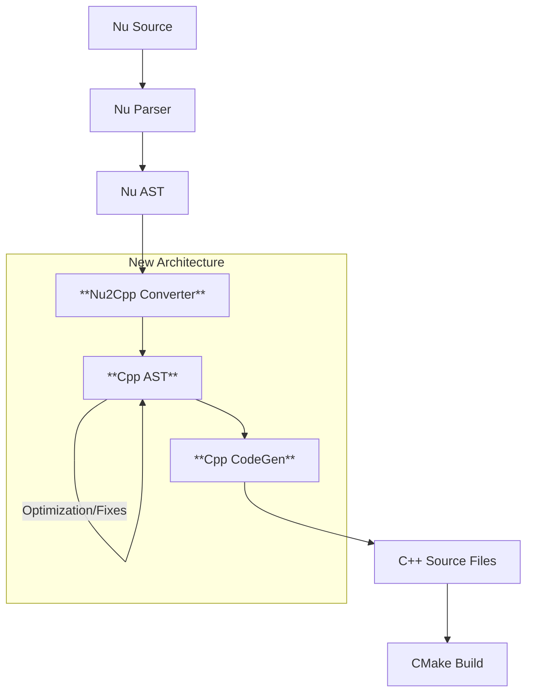

# Nu2CPP Re-evaluation & Improvement Plan

**Status**: Draft
**Date**: 2025-12-28
**Objective**: Rescue the Nu2CPP project from its current "stalled" state by refactoring the architecture and fixing fundamental generation errors.

## 1. Current Situation Analysis

### 1.1 Critical Issues
### 1.1 Critical Issues & "Pitfalls" (from Nu2Rust experience)
See **[docs/NU2CPP_DEEP_EVALUATION.md](file:///home/sonygod/projects/nu/docs/NU2CPP_DEEP_EVALUATION.md)** for a detailed analysis of why the current approach failed.

1.  **Monolithic Architecture**: The entire logic resides in a single `src/nu2cpp/mod.rs` file (>3000 lines). This makes "string-based" code generation extremely brittle and hard to debug.
2.  **The Semicolon Hell**: Nu2Rust has ~200 lines just to guess semicolon placement. Nu2CPP cannot afford this complexity for C++.
3.  **Broken Generics**: Tests (`generics_test`) fail with syntax errors like `I< T> Container< T> {`. C++ templates require precise AST structure, not regex.
4.  **Concurrency/Closure Failures**: Tests (`concurrency-pointers`) fail because captured variables in closures (`|...|`) are not correctly lifted into C++ lambda captures (`[=]` or `[&]`).
5.  **Divergence from Plan**: The implementation does not follow `NU2CPP_DETAILED_PLAN.md`.

### 1.2 "Why is it hard to proceed?"
You are currently doing **S2S (Source-to-Source) conversion via string manipulation**. 
*   *Problem*: You are trying to print valid C++ code directly while traversing Nu code.
*   *Result*: Complex nesting (Generics inside Result inside Option) breaks the state machine.
*   *Solution*: You need an **Intermediate Representation (IR)** or a **Target AST**.

---

## 2. Revised Architecture (The "Rescue" Plan)

We will move from `Nu AST -> String` to `Nu AST -> CppAST -> String`.



### 2.1 The C++ AST (Intermediate Representation)
Instead of printing strings immediately, we build a lightweight C++ AST structure.

```rust
// logical structure example
enum CppType {
    Void,
    Int32,
    Template(String, Vec<CppType>), // e.g., vector<string>
    // ...
}

struct CppFunction {
    name: String,
    return_type: CppType,
    params: Vec<(String, CppType)>,
    body: Vec<CppStmt>,
    template_params: Vec<String>, // <typename T>
    is_static: bool,
}

struct CppClass {
    name: String,
    template_params: Vec<String>,
    members: Vec<CppMember>,
    methods: Vec<CppFunction>,
}
```

**Benefit**: deeply nested generics like `Vec<Box<Result<T, E>>>` become tree structures, preventing `>>` vs `> >` issues and ensuring correct placement of `template<...>` headers.

---

## 3. Implementation Roadmap

### Phase 1: Modularization (Day 1-2)
*   **Goal**: Stop bleeding. Break `mod.rs` apart.
*   **Actions**:
    1.  Create `src/nu2cpp/cpp_ast.rs`: Define the C++ AST.
    2.  Create `src/nu2cpp/codegen.rs`: Simple logic to `impl Display for CppAST` (The "Printer").
    3.  Refactor `mod.rs` to parse Nu AST and emit `CppAST` nodes instead of Strings.

### Phase 2: Fix Generics & Structs (Day 3-4)
*   **Goal**: Pass `generics_test`.
*   **Actions**:
    1.  Implement `CppClass` generation.
    2.  When encountering `S Foo<T>`, generate a `CppClass` with `template_params = vec!["T"]`.
    3.  When encountering `I Foo<T>`, attach methods to the generic `CppClass` or generate free-standing template functions if needed.
    4.  **Fix syntax**: Ensure `template<typename T>` is emitted on the line *before* the struct/function, not inline.

### Phase 3: Fix Closures & Concurrency (Day 5)
*   **Goal**: Pass `concurrency-pointers`.
*   **Actions**:
    1.  Analyze `|x, y| { ... }` blocks.
    2.  Identify variables defined *outside* but used *inside*.
    3.  Generate C++ Lambda: `[=](auto x, auto y) { ... }` (default query capture) or explicit captures for mutable references.
    4.  Support `move ||` semantics via `std::move` in captures.

---

## 4. Immediate Next Steps (Action Items)

1.  **Refactor**: Begin by creating the `cpp_ast` module.
2.  **Migration**: Migrate the "easy" parts (imports, basic functions) to the new AST system first.
3.  **Verify**: Run `test_simple` to ensure no regression.

## Recommended Command for User
`bash test_examples_roundtrip_cpp.sh` (Current state: BROKEN) -> **Goal**: GREEN.
