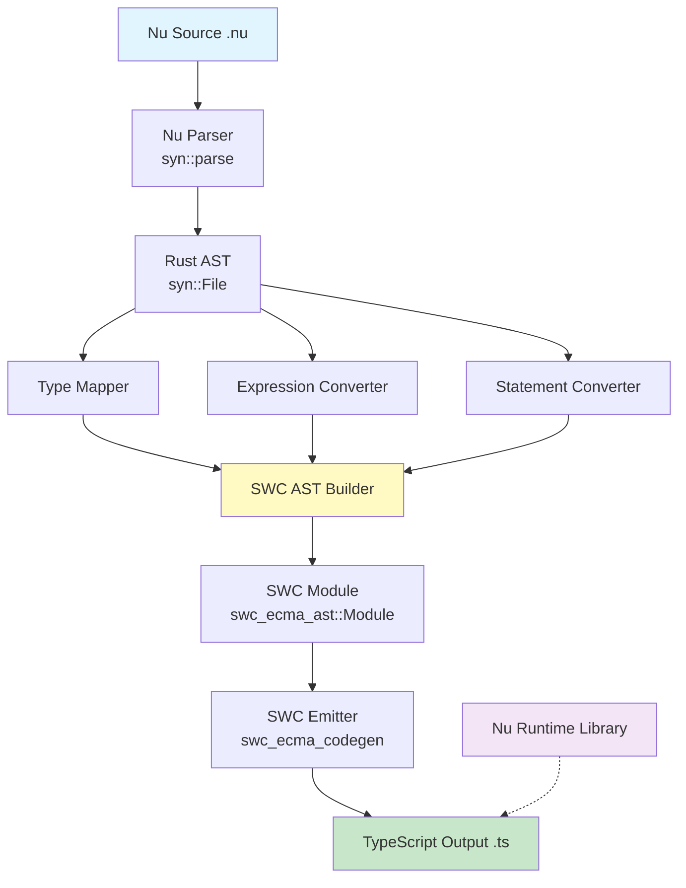

# Nu2TS Compiler Implementation Plan

## Executive Summary

This plan outlines the development of **`nu2ts`**, a production-grade compiler that transpiles Nu language code to TypeScript using SWC (Speedy Web Compiler) AST-based code generation.

**Key Decisions:**
- ✅ **Target Language**: TypeScript (not JavaScript)
- ✅ **Code Generation**: SWC AST Builder (not string concatenation)
- ✅ **Type System**: Preserve strong typing from Nu/Rust
- ✅ **Memory Model**: Type Erasure - remove all Rust ownership semantics
- ✅ **Runtime Strategy**: **Zero-Runtime** - minimal polyfill (only Result type)
- ✅ **Timeline**: 8-9 weeks to MVP (production-ready)

> **IMPORTANT**: Full mapping specification is defined in [`docs/cn/nu2ts.md`](file:///home/sonygod/projects/nu/docs/cn/nu2ts.md).
> This plan implements that specification using SWC AST infrastructure.

---

## 1. Technical Architecture

### Architecture Overview



### Component Breakdown

| Component | Responsibility | Technology |
|-----------|---------------|------------|
| **Nu Parser** | Parse `.nu` files to Rust AST | `syn` (existing) |
| **Type Mapper** | Rust types → TS types | Custom logic |
| **AST Converter** | Rust AST → SWC AST | `swc_ecma_ast` |
| **Code Emitter** | SWC AST → TS source | `swc_ecma_codegen` |
| **Runtime Library** | Polyfills for Rust types | TypeScript package |
| **CLI Tool** | User interface | `clap` |

---

## 2. Type Mapping Strategy

### Primitive Types

| Nu/Rust Type | TypeScript Type | Notes |
|--------------|-----------------|-------|
| `i8, i16, i32, i64` | `number` | No overflow checking |
| `u8, u16, u32, u64` | `number` | JS has no unsigned |
| `f32, f64` | `number` | |
| `bool` | `boolean` | |
| `String, Str` | `string` | |
| `char` | `string` | Single character |
| `()` | `void` | Unit type |
| `!` | `never` | Never type |

### Collection Types

| Nu/Rust Type | TypeScript Type | Strategy |
|--------------|-----------------|----------|
| `Vec<T>` | `Array<T>` | Direct mapping |
| `[T; N]` | `T[]` | Lose compile-time size |
| `HashMap<K,V>` | `Map<K,V>` | Runtime type |
| `HashSet<T>` | `Set<T>` | Runtime type |
| `BTreeMap<K,V>` | `Map<K,V>` | Lose ordering guarantee |

### Smart Pointers & References

| Nu/Rust Type | TypeScript Type | Strategy |
|--------------|-----------------|----------|
| `&T` | `T` | Ignore borrow |
| `&mut T` | `T` | Ignore mutability |
| `Box<T>` | `T` | No heap indirection needed |
| `Rc<T>` | `T` | GC handles lifecycle |
| `Arc<T>` | `T` | No thread safety in JS |
| `RefCell<T>` | `T` | No runtime borrow check |

### Option & Result

**Strategy: Zero-Runtime Discriminated Unions (per nu2ts.md spec)**

```typescript
// Option<T> → T | null (inline, no runtime class)
type Option<T> = T | null;

// Result<T, E> → Discriminated Union (minimal polyfill)
type Result<T, E> = 
  | { tag: 'ok'; val: T }
  | { tag: 'err'; err: E };

const Ok = <T>(val: T): Result<T, any> => ({ tag: 'ok', val });
const Err = <E>(err: E): Result<any, E> => ({ tag: 'err', err });
```

**Key Points:**
- ✅ **Option**: Pure union type `T | null` (no undefined)
- ✅ **Result**: Micro-polyfill injected once per file
- ✅ No runtime classes - all type-level constructs
- ✅ Pattern matching via type guards: `if (result.tag === 'ok')`

### Struct & Enum

| Nu/Rust | TypeScript | Example |
|---------|------------|---------|
| `struct` | `interface` or `type` | See below |
| C-like `enum` | `enum` | Direct mapping |
| Data-carrying `enum` | Discriminated Union | See below |

**Struct Example:**
```rust
// Nu/Rust
S Person {
    name: Str,
    age: u32,
}
```
```typescript
// Generated TypeScript
export interface Person {
  name: string;
  age: number;
}
```

**Enum Example:**
```rust
// Nu/Rust - C-like enum
E Status {
    Pending,
    Active,
    Done,
}
```
```typescript
// Generated TypeScript
export enum Status {
  Pending = "Pending",
  Active = "Active",
  Done = "Done",
}
```

**Data-Carrying Enum:**
```rust
// Nu/Rust
E Message {
    Quit,
    Move { x: i32, y: i32 },
    Write(Str),
}
```
```typescript
// Generated TypeScript
export type Message =
  | { type: "Quit" }
  | { type: "Move"; x: number; y: number }
  | { type: "Write"; value: string };
```

---

## 3. SWC Integration Details

### Dependencies Setup

```toml
[dependencies]
# Existing dependencies
syn = { version = "2.0", features = ["full", "extra-traits"] }
quote = "1.0"
anyhow = "1.0"
clap = { version = "4.0", features = ["derive"] }

# New: SWC dependencies
swc_core = { version = "0.90", features = ["ecma_ast", "ecma_codegen", "common"] }
swc_ecma_ast = "0.114"
swc_ecma_codegen = "0.150"
swc_common = { version = "0.33", features = ["sourcemap"] }
```

### AST Building Example

**Converting a simple function:**

```rust
use swc_ecma_ast::*;
use swc_common::{DUMMY_SP, Spanned};

pub struct TsCodegen {
    module: Module,
}

impl TsCodegen {
    /// Convert Rust function to TS function declaration
    pub fn convert_function(&mut self, rust_fn: &syn::ItemFn) -> ModuleItem {
        let name = rust_fn.sig.ident.to_string();
        
        // Build parameters
        let params = rust_fn.sig.inputs.iter()
            .map(|arg| self.convert_param(arg))
            .collect();
        
        // Build return type annotation
        let return_type = self.convert_return_type(&rust_fn.sig.output);
        
        // Build function body
        let body = self.convert_block(&rust_fn.block);
        
        // Construct SWC FnDecl AST node
        ModuleItem::Stmt(Stmt::Decl(Decl::Fn(FnDecl {
            ident: Ident::new(name.into(), DUMMY_SP),
            declare: false,
            function: Box::new(Function {
                params,
                decorators: vec![],
                span: DUMMY_SP,
                body: Some(body),
                is_generator: false,
                is_async: self.is_async_fn(rust_fn),
                type_params: None,
                return_type: Some(Box::new(return_type)),
            }),
        })))
    }
    
    fn convert_param(&self, param: &syn::FnArg) -> Param {
        match param {
            syn::FnArg::Typed(pat_type) => {
                let name = self.extract_param_name(&pat_type.pat);
                let ts_type = self.convert_type(&pat_type.ty);
                
                Param {
                    span: DUMMY_SP,
                    decorators: vec![],
                    pat: Pat::Ident(BindingIdent {
                        id: Ident::new(name.into(), DUMMY_SP),
                        type_ann: Some(Box::new(TsTypeAnn {
                            span: DUMMY_SP,
                            type_ann: Box::new(ts_type),
                        })),
                    }),
                }
            }
            syn::FnArg::Receiver(_) => {
                // Handle 'self' parameter
                self.convert_self_param()
            }
        }
    }
    
    fn convert_type(&self, ty: &syn::Type) -> TsType {
        match ty {
            syn::Type::Path(type_path) => {
                let path = &type_path.path;
                let segment = path.segments.last().unwrap();
                let type_name = segment.ident.to_string();
                
                match type_name.as_str() {
                    "i32" | "i64" | "u32" | "u64" | "f32" | "f64" => {
                        TsType::TsKeywordType(TsKeywordType {
                            span: DUMMY_SP,
                            kind: TsKeywordTypeKind::TsNumberKeyword,
                        })
                    }
                    "bool" => {
                        TsType::TsKeywordType(TsKeywordType {
                            span: DUMMY_SP,
                            kind: TsKeywordTypeKind::TsBooleanKeyword,
                        })
                    }
                    "String" | "Str" => {
                        TsType::TsKeywordType(TsKeywordType {
                            span: DUMMY_SP,
                            kind: TsKeywordTypeKind::TsStringKeyword,
                        })
                    }
                    "Vec" | "V" => {
                        // Vec<T> -> Array<T>
                        let elem_type = self.extract_generic_arg(segment);
                        TsType::TsArrayType(TsArrayType {
                            span: DUMMY_SP,
                            elem_type: Box::new(elem_type),
                        })
                    }
                    "Option" | "O" => {
                        // Option<T> -> T | null
                        let inner_type = self.extract_generic_arg(segment);
                        TsType::TsUnionOrIntersectionType(
                            TsUnionOrIntersectionType::TsUnionType(TsUnionType {
                                span: DUMMY_SP,
                                types: vec![
                                    Box::new(inner_type),
                                    Box::new(TsType::TsKeywordType(TsKeywordType {
                                        span: DUMMY_SP,
                                        kind: TsKeywordTypeKind::TsNullKeyword,
                                    })),
                                ],
                            })
                        )
                    }
                    _ => {
                        // Reference to user-defined type
                        TsType::TsTypeRef(TsTypeRef {
                            span: DUMMY_SP,
                            type_name: TsEntityName::Ident(Ident::new(
                                type_name.into(),
                                DUMMY_SP,
                            )),
                            type_params: None,
                        })
                    }
                }
            }
            _ => {
                // Other type forms
                self.convert_complex_type(ty)
            }
        }
    }
}
```

### Code Emission

```rust
use swc_ecma_codegen::{Emitter, Config};
use swc_common::SourceMap;
use std::sync::Arc;

pub fn emit_typescript(module: Module) -> Result<String> {
    let source_map = Arc::new(SourceMap::default());
    let mut buf = vec![];
    
    {
        let mut emitter = Emitter {
            cfg: Config::default(),
            cm: source_map.clone(),
            comments: None,
            wr: Box::new(swc_ecma_codegen::text_writer::JsWriter::new(
                source_map.clone(),
                "\n",
                &mut buf,
                None,
            )),
        };
        
        emitter.emit_module(&module)?;
    }
    
    let code = String::from_utf8(buf)?;
    Ok(code)
}
```

---

## 4. Control Flow Conversion

### Match Expression Strategies

**Strategy A: Simple Enum → switch/case**

```rust
// Nu
M color {
    Red: { < 1 },
    Green: { < 2 },
    Blue: { < 3 },
}
```

```typescript
// Generated TS
switch (color) {
  case Color.Red:
    return 1;
  case Color.Green:
    return 2;
  case Color.Blue:
    return 3;
}
```

**Strategy B: Complex Pattern → if/else + type guards**

```rust
// Nu
M message {
    Quit: { println!("Quit") },
    Move { x, y }: { println!("{}, {}", x, y) },
    Write(text): { println!("{}", text) },
}
```

```typescript
// Generated TS
if (message.type === "Quit") {
  console.log("Quit");
} else if (message.type === "Move") {
  const { x, y } = message;
  console.log(`${x}, ${y}`);
} else if (message.type === "Write") {
  const text = message.value;
  console.log(text);
}
```

**Strategy C: Runtime Helper (Fallback)**

```typescript
// nu-ts-runtime/match.ts
export function match<T, R>(
  value: T,
  patterns: Record<string, (val: any) => R>
): R {
  for (const [pattern, handler] of Object.entries(patterns)) {
    // Pattern matching logic
    if (matchesPattern(value, pattern)) {
      return handler(value);
    }
  }
  throw new Error("Non-exhaustive match");
}
```

### Loop Conversion

| Nu/Rust | TypeScript |
|---------|------------|
| `L { ... }` | `while (true) { ... }` |
| `L i: range` | `for (const i of range) { ... }` |
| `L item: vec` | `for (const item of vec) { ... }` |
| `while cond { ... }` | `while (cond) { ... }` |

---

## 5. Zero-Runtime Design (per nu2ts.md)

### Minimal Polyfill Strategy

Per [`nu2ts.md` Section 10](file:///home/sonygod/projects/nu/docs/cn/nu2ts.md#10-必需的-micro-prelude-standard-polyfill), the compiler injects a **micro-prelude** only when Result types are used:

```typescript
// --- Nu2TS Runtime Polyfill (injected once per file if needed) ---
export type Result<T, E> = { tag: 'ok'; val: T } | { tag: 'err'; err: E };
export const Ok = <T>(val: T): Result<T, any> => ({ tag: 'ok', val });
export const Err = <E>(err: E): Result<any, E> => ({ tag: 'err', err });
// -----------------------------------------------------------------
```

### Option<T> Handling

**No runtime helper** - pure type-level:

```typescript
// Compiler generates inline union types
let maybeValue: number | null = null;  // Option<number> → number | null

if (maybeValue !== null) {
  console.log(maybeValue);  // Type narrowing
}
```

### Key Principles

1. ✅ **No npm dependency** for basic types
2. ✅ **Inline polyfill** only for Result (3 lines)
3. ✅ **Tree-shakeable** - polyfill only when Result is used
4. ✅ **Zero overhead** - all type-level constructs

### Optional: Full Runtime Library (Advanced)

For users who want Rust-like ergonomics, we can provide **optional** `nu-ts-runtime` package:

```bash
npm install nu-ts-runtime  # Optional, not required
```

```typescript
import { Option, Result } from 'nu-ts-runtime';

// Rich API with map, andThen, etc.
const result = Option.Some(42).map(x => x * 2);
```

But the **default codegen mode** uses zero-runtime approach.

---

## 6. CLI Tool Design

### Command Structure

```bash
# Basic conversion
nu2ts input.nu -o output.ts

# Convert directory
nu2ts src/ -o dist/

# Target runtime
nu2ts input.nu --target node     # Node.js with fs, path, etc.
nu2ts input.nu --target browser  # Browser-safe only

# Runtime library mode
nu2ts input.nu --runtime full    # Import all helpers
nu2ts input.nu --runtime minimal # Inline only used helpers
nu2ts input.nu --runtime none    # No runtime, manual handling

# Source maps
nu2ts input.nu --sourcemap

# Watch mode
nu2ts src/ -o dist/ --watch

# Format output
nu2ts input.nu --prettier
```

### CLI Implementation

```rust
// src/bin/nu2ts.rs
use clap::Parser;
use nu_compiler::codegen::ts::TsCodegen;
use anyhow::Result;

#[derive(Parser)]
#[command(name = "nu2ts")]
#[command(about = "Nu to TypeScript Compiler", long_about = None)]
struct Cli {
    /// Input Nu file or directory
    input: String,
    
    /// Output TypeScript file or directory
    #[arg(short, long)]
    output: Option<String>,
    
    /// Target runtime environment
    #[arg(long, default_value = "node")]
    target: RuntimeTarget,
    
    /// Runtime library mode
    #[arg(long, default_value = "full")]
    runtime: RuntimeMode,
    
    /// Generate source maps
    #[arg(long)]
    sourcemap: bool,
    
    /// Watch mode
    #[arg(short, long)]
    watch: bool,
    
    /// Format with prettier
    #[arg(long)]
    prettier: bool,
    
    /// Verbose output
    #[arg(short, long)]
    verbose: bool,
}

#[derive(Clone, clap::ValueEnum)]
enum RuntimeTarget {
    Node,
    Browser,
    Deno,
}

#[derive(Clone, clap::ValueEnum)]
enum RuntimeMode {
    Full,
    Minimal,
    None,
}

fn main() -> Result<()> {
    let cli = Cli::parse();
    
    let mut codegen = TsCodegen::new()
        .with_target(cli.target)
        .with_runtime(cli.runtime)
        .with_sourcemap(cli.sourcemap);
    
    if cli.watch {
        codegen.watch(&cli.input, cli.output.as_deref())?;
    } else {
        codegen.compile(&cli.input, cli.output.as_deref())?;
    }
    
    Ok(())
}
```

---

## 7. Complete Conversion Example

### Input: Nu Code

```rust
// calculator.nu
u std::collections::HashMap

#D(Debug, Clone)
S Calculator {
    cache: HashMap<Str, i32>
}

I Calculator {
    F new() -> Self {
        Calculator { 
            cache: HashMap::new() 
        }
    }
    
    F add(a: i32, b: i32) -> i32 {
        < a + b
    }
    
    F compute(x: i32) -> R<i32, Str> {
        ? x < 0 {
            < Err("Negative input".to_string())
        }
        
        l result = x * 2;
        < Ok(result)
    }
    
    f private_helper() -> bool {
        < true
    }
}

E Status {
    Pending,
    Active,
    Done,
}

f main() {
    l calc = Calculator::new();
    l sum = calc.add(10, 20);
    
    M calc.compute(sum) {
        Ok(val): {
            println!("Success: {}", val);
        },
        Err(e): {
            println!("Error: {}", e);
        }
    }
}
```

### Output: Generated TypeScript

```typescript
// calculator.ts
import { Result } from 'nu-ts-runtime';

export interface Calculator {
  cache: Map<string, number>;
}

export namespace Calculator {
  export function new(): Calculator {
    return {
      cache: new Map(),
    };
  }

  export function add(a: number, b: number): number {
    return a + b;
  }

  export function compute(x: number): Result<number, string> {
    if (x < 0) {
      return Result.Err("Negative input");
    }

    const result = x * 2;
    return Result.Ok(result);
  }

  function privateHelper(): boolean {
    return true;
  }
}

export enum Status {
  Pending = "Pending",
  Active = "Active",
  Done = "Done",
}

function main(): void {
  const calc = Calculator.new();
  const sum = Calculator.add(10, 20);

  const computeResult = Calculator.compute(sum);
  if (computeResult.isOk()) {
    const val = computeResult.unwrap();
    console.log(`Success: ${val}`);
  } else {
    const e = computeResult.unwrapErr();
    console.log(`Error: ${e}`);
  }
}

main();
```

---

## 8. Testing Strategy

### Test Categories

1. **Unit Tests**: Individual converters
2. **Integration Tests**: End-to-end conversion
3. **Snapshot Tests**: Golden file comparisons
4. **Runtime Tests**: Execute generated TS with Node.js

### Test Structure

```
tests/
├── type_mapping/
│   ├── primitives.rs
│   ├── collections.rs
│   ├── generics.rs
│   └── expected/
│       ├── primitives.ts
│       └── ...
├── control_flow/
│   ├── if_else.rs
│   ├── loops.rs
│   ├── match.rs
│   └── expected/
├── advanced/
│   ├── traits.rs
│   ├── async.rs
│   └── expected/
└── integration/
    ├── calculator.nu
    ├── web_server.nu
    └── expected/
```

### Test Example

```rust
#[cfg(test)]
mod tests {
    use super::*;
    use pretty_assertions::assert_eq;

    #[test]
    fn test_struct_to_interface() {
        let nu_code = r#"
            S Person {
                name: Str,
                age: u32,
            }
        "#;

        let expected_ts = r#"
export interface Person {
  name: string;
  age: number;
}
        "#.trim();

        let converter = TsCodegen::new();
        let result = converter.convert(nu_code).unwrap();
        assert_eq!(result.trim(), expected_ts);
    }

    #[test]
    fn test_function_conversion() {
        let nu_code = r#"
            F add(a: i32, b: i32) -> i32 {
                < a + b
            }
        "#;

        let expected_ts = r#"
export function add(a: number, b: number): number {
  return a + b;
}
        "#.trim();

        let converter = TsCodegen::new();
        let result = converter.convert(nu_code).unwrap();
        assert_eq!(result.trim(), expected_ts);
    }
}
```

---

## 9. Timeline & Milestones

### Week 1-2: Foundation
- ✅ Setup SWC dependencies
- ✅ Create project structure
- ✅ Implement primitive type mapping
- ✅ Implement struct/interface conversion
- ✅ Basic AST building with SWC
- 🎯 **Milestone 1**: Can convert simple structs and functions

### Week 3-4: Core Logic
- ✅ Function conversion (params, return types, body)
- ✅ Variable declarations (let, let mut)
- ✅ Basic expressions (arithmetic, comparisons)
- ✅ Control flow (if/else, loops)
- ✅ Match expression (simple cases)
- 🎯 **Milestone 2**: Can convert basic algorithms

### Week 5-6: Advanced Features
- ✅ Trait to interface conversion
- ✅ Impl blocks to classes/namespaces
- ✅ Macro expansion (println!, vec!, etc.)
- ✅ Async/await support
- ✅ Closures
- ✅ Complex match patterns
- 🎯 **Milestone 3**: Can convert real-world Rust code

### Week 7: Runtime Library
- ✅ Option<T> implementation
- ✅ Result<T,E> implementation
- ✅ Collection wrappers
- ✅ Std library facades
- ✅ Publish npm package
- 🎯 **Milestone 4**: Runtime library v1.0.0

### Week 8-9: Polish & Release
- ✅ CLI improvements
- ✅ Source map generation
- ✅ Documentation
- ✅ Examples
- ✅ CI/CD pipeline
- 🎯 **Milestone 5**: Public beta release

---

## 10. Risk Mitigation

### Technical Risks

| Risk | Impact | Mitigation |
|------|--------|------------|
| **Complex match patterns** | High | Fallback to runtime helper |
| **Macro system** | Medium | Expand common macros, warn for others |
| **Generic constraints** | Medium | Convert to TS constraints, simplify |
| **Lifetime annotations** | Low | Ignore, add comment |
| **Unsafe blocks** | Medium | Convert to normal code, add warning comment |

### Non-Technical Risks

| Risk | Impact | Mitigation |
|------|--------|------------|
| **Scope creep** | High | Strict phase boundaries |
| **SWC API changes** | Medium | Pin versions, monitor releases |
| **TypeScript evolution** | Low | Target stable TS features |
| **User expectations** | Medium | Clear documentation of limitations |

---

## 11. Success Metrics

### MVP Success Criteria

- ✅ Can convert 80%+ of Nu examples to valid TypeScript
- ✅ Generated code passes `tsc --strict`
- ✅ Runtime library has <10KB gzipped footprint
- ✅ Compilation speed: >10,000 LOC/second
- ✅ Test coverage: >85%

### Long-term Goals

- 📈 Adoption by 100+ projects
- 📈 npm package: 1,000+ weekly downloads
- 📈 Community contributions: 10+ external PRs
- 📈 Integration with bundlers (Vite, webpack)

---

## 12. Next Steps

### Immediate Actions (This Week)

1. **Create `src/codegen/ts/` module structure**
2. **Add SWC dependencies to Cargo.toml**
3. **Implement first type mapper (primitives)**
4. **Write first integration test (struct → interface)**
5. **Create `nu2ts` CLI skeleton**

### Questions for Review

- [ ] Confirm union types vs runtime classes for Option/Result?
- [ ] Target ES2020+ syntax or transpile to ES5?
- [ ] Bundle runtime library or keep modular?
- [ ] Support `.d.ts` generation only mode?

---

## Conclusion

This plan provides a clear, achievable path to building a production-grade Nu to TypeScript compiler. The SWC-based approach ensures correctness, maintainability, and performance. With 8-9 weeks of focused development, `nu2ts` will unlock Nu language for the entire JavaScript/TypeScript ecosystem.

**Ready to proceed? 🚀**
