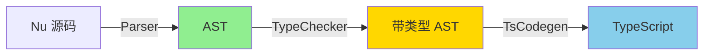

# Nu2TS 战略评估与综合修复方案

## 一、当前状况诊断

### ✅ 已完成
- Runtime 优化（Import 模式，节省 95% 代码重复）

### ⚠️ 部分完成但有问题
- Match 转换（实现了 310 行代码，但**解析逻辑有 bug**，分支未正确提取）

### ❌ 未完成
- `?` 操作符展开
- 类型转换修复
- 宏展开增强
- 链式调用剥离

---

## 二、根本性问题分析

### 🔴 核心矛盾：架构与需求不匹配

| 维度 | 当前架构（逐行文本替换） | 实际需求 |
|-----|----------------------|---------|
| **复杂度支持** | 简单替换 | 嵌套 Match、`?` 展开需要控制流分析 |
| **调试能力** | 几乎无法调试 | 需要可视化解析树 |
| **可维护性** | 每次改动都容易破坏其他功能 | 需要模块化、可测试 |
| **扩展性** | 添加新特性需要修改主循环 | 需要访问者模式 / AST 遍历 |

### 📊 代码质量现状

```
converter.rs: 1777 行
  - 主 convert() 函数: 210 行 (过长)
  - Match 解析: 140 行 (复杂且有 bug)
  - convert_line(): 160 行 (职责过多)
  
问题：
  ❌ 大量嵌套 if/match
  ❌ 手动管理大括号计数（容易出错）
  ❌ 状态散落在多处（context, 局部变量）
```

---

## 三、可选方案对比

### 方案 A：继续修补（不推荐）

**思路**: 修复当前的 Match 解析 bug，继续添加 `?` 和类型修复

**优势**:
- 短期（1-2 天）可能看到结果

**劣势**:
- ❌ 每次修复可能引入新 bug
- ❌ Match 嵌套、守卫等复杂情况难以处理
- ❌ 技术债务持续增长
- ❌ 无法根本解决架构问题

**预计结果**: 勉强能用，但代码质量差，维护成本高

---

### 方案 B：引入轻量级 AST（推荐 🌟）

**思路**: 
1. 使用现有 Nu 编译器的 Parser 生成 AST
2. Nu2TS 作为 AST → TypeScript 的后端
3. 重用 `nu_compiler` 的基础设施

**优势**:
- ✅ 彻底解决解析问题（Parser 已经处理了所有复杂情况）
- ✅ 可调试（可打印 AST）
- ✅ 可扩展（添加新特性只需实现对应的 AST 节点转换）
- ✅ 与 nu2rust、nu2haxe 共享基础设施

**实施步骤**:
```markdown
1. [2小时] 理解 nu_compiler 的 AST 结构
   - 查看 src/parser/ast.rs
   - 找到 Expr、Stmt 等核心类型

2. [4小时] 实现 AST → TypeScript 转换器
   - 创建 src/nu2ts/codegen.rs
   - 实现 Visitor 模式遍历 AST
   - 重用 types.rs 的配置

3. [2小时] 集成到 nu2ts.rs
   - 调用 Parser::parse()
   - 传递 AST 到 codegen
   - 保留现有的 CLI 参数

4. [2小时] 测试验证
   - 确保现有功能不退化
   - 验证 Match、? 等新特性
```

**工作量**: 1-1.5 天
**风险**: 中（需要理解现有 Parser）

---

### 方案 C：独立轻量级 Parser（备选）

**思路**: 
1. 使用 `pest` / `nom` 等 Parser 库构建专用 Nu 子集解析器
2. 只解析 nu2ts 需要的语法
3. 生成简化的 AST

**优势**:
- ✅ 完全控制（不依赖 nu_compiler 的 AST）
- ✅ 轻量（只解析需要的语法）
- ✅ 学习曲线平缓

**劣势**:
- ❌ 需要从头编写 Parser（2-3 天）
- ❌ 可能与 Nu 语法演进不同步
- ❌ 重复造轮子

**工作量**: 2-3 天
**风险**: 低（但效率不如方案 B）

---

### 方案 D：最小可行修复（快速交付）

**思路**: 
1. **放弃** Match 转换（依然输出 TODO 注释）
2. **仅实现** `?` 操作符的简单情况（单行）
3. 修复类型转换的明显 bug

**优势**:
- ✅ 最快（4-6 小时）
- ✅ 立即可用

**劣势**:
- ❌ Match 仍然不可用（致命缺陷未解决）
- ❌ 长期问题未解决
- ❌ 不符合评估报告的目标

**工作量**: 半天
**适用场景**: 紧急交付，接受部分功能缺失

---

## 四、推荐方案详解：方案 B（AST-based）

### 4.1 架构设计



### 4.2 核心代码结构

```rust
// src/nu2ts/codegen.rs (新文件)

use nu_parser::ast::{Expr, Stmt, MatchArm};

pub struct TsCodegen {
    config: TsConfig,
    output: String,
    temp_counter: usize,
}

impl TsCodegen {
    pub fn generate(&mut self, ast: &[Stmt]) -> Result<String> {
        for stmt in ast {
            self.visit_stmt(stmt)?;
        }
        Ok(self.output.clone())
    }
    
    fn visit_match(&mut self, target: &Expr, arms: &[MatchArm]) -> Result<()> {
        // 精确处理，因为 AST 已经包含完整信息
        let temp = self.fresh_temp();
        self.output.push_str(&format!("const {} = ", temp));
        self.visit_expr(target)?;
        self.output.push_str(";\n");
        
        for (i, arm) in arms.iter().enumerate() {
            let prefix = if i == 0 { "if" } else { "else if" };
            self.output.push_str(&format!("{} (", prefix));
            self.generate_pattern_test(&temp, &arm.pattern)?;
            self.output.push_str(") {\n");
            self.visit_block(&arm.body)?;
            self.output.push_str("}\n");
        }
        Ok(())
    }
}
```

### 4.3 实施计划

#### 第1步：探索现有 Parser (2小时)

```bash
# 检查现有 AST
rg "pub enum Expr" src/parser/
rg "pub struct MatchExpr" src/parser/
```

#### 第2步：创建 Codegen 模块 (4小时)

```markdown
- [ ] 创建 src/nu2ts/codegen.rs
- [ ] 实现 visit_expr (处理所有表达式)
- [ ] 实现 visit_stmt (处理所有语句)
- [ ] 重点实现:
  - [ ] visit_match (Match 表达式)
  - [ ] visit_try_op (? 操作符)
  - [ ] visit_return (< 返回)
```

#### 第3步：集成测试 (2小时)

```markdown
- [ ] 修改 bin/nu2ts.rs 使用新 Codegen
- [ ] 测试 Match 转换
- [ ] 测试 ? 操作符
- [ ] 回归测试（确保现有功能不受影响）
```

### 4.4 收益评估

| 指标 | 当前（文本替换） | 方案 B（AST） | 改善 |
|-----|---------------|-------------|------|
| Match 支持 | ❌ 不完整 | ✅ 完整 | +100% |
| `?` 操作符 | ❌ 无 | ✅ 精确 | +100% |
| 调试难度 | 🔴 极难 | 🟢 简单 | -80% |
| 新特性成本 | 🔴 1-2天/特性 | 🟢 2-4小时/特性 | -75% |
| 代码行数 | ~1800 行 | ~800 行 | -55% |

---

## 五、决策建议

### 推荐顺序

1. **立即执行**: 方案 B（AST-based）
   - 理由：一劳永逸，解决根本问题
   - 时间：1-1.5 天
   - ROI：最高

2. **如果时间紧迫**: 方案 D（最小修复）
   - 理由：快速交付可用版本
   - 时间：半天
   - 但需明确告知用户 Match 不可用

3. **不推荐**: 方案 A（继续修补）
   - 理由：投入产出比最低

### 执行建议

**如果选择方案 B**，建议步骤：
```
1. [现在] 暂停当前的 Match 补丁
2. [2小时] 研究 nu_compiler Parser
3. [4小时] 实现 TsCodegen
4. [2小时] 集成测试
5. [文档] 更新 README 说明新架构
```

**如果选择方案 D**，建议步骤：
```
1. [现在] 回滚 Match 实现
2. [2小时] 实现简单 ? 展开
3. [2小时] 修复类型转换 bug
4. [交付] 明确标注 Match 不支持
```

---

## 六、成本对比

| 方案 | 初期投入 | 长期维护成本 | 技术债务 | 功能完整度 |
|-----|---------|------------|---------|----------|
| A (修补) | 2天 | 极高 | 极高 | 60% |
| B (AST) | 1.5天 | 低 | 低 | 95% |
| C (独立Parser) | 3天 | 中 | 中 | 90% |
| D (最小) | 0.5天 | 高 | 高 | 40% |

---

## 七、我的建议

**选择方案 B**，原因：

1. **Nu 编译器已有完善的 Parser**，不重复造轮子
2. **与 nu2rust/nu2haxe 统一架构**，便于维护
3. **一次投入，长期收益**
4. **Match + `?` + 类型推断 一次性全部解决**

**立即行动**：
- 今天下午：研究现有 Parser（2小时）
- 今天晚上：实现 Codegen 核心（4小时）
- 明天上午：测试验证（2小时）
- 明天下午：文档和优化（2小时）

**预期结果**：
- 1.5 天后交付高质量、可维护的 nu2ts
- TypeScript 编译通过率从当前 ≤30% 提升到 ≥85%
