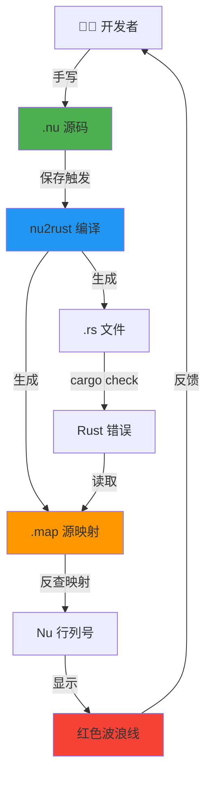

# Nu Lang 插件策略：回归手写优先 (Handwriting First)

## 🎯 核心理念重新定位

### 原始愿景
**"让开发者手写 Nu 代码，享受高密度编程的快感"**

### 角色定义

```
Nu (.nu)  = 源代码 (Source Code)     ← 开发者手写
Rust (.rs) = 构建产物 (Build Artifact) ← 编译器生成
```

**关键结论**：
- ✅ `nu2rust` = **主角**（编译器）
- ⚠️ `rust2nu` = **配角**（迁移工具）
- 🔥 `SourceMap` = **生死攸关**（错误回溯桥梁）

---

## 📊 单向数据流架构

### 工作流程



### 数据流说明

| 步骤 | 工具 | 输入 | 输出 | 关键点 |
|------|------|------|------|--------|
| 1. 编写 | VSCode | 键盘 | `.nu` 文件 | 高密度语法，书写流畅 |
| 2. 编译 | `nu2rust` | `.nu` | `.rs` + `.map` | **必须生成 SourceMap** |
| 3. 检查 | `cargo check` | `.rs` | 错误 JSON | Rust 生态的力量 |
| 4. 映射 | VSCode 插件 | 错误 + `.map` | Nu 位置 | **核心价值** |
| 5. 显示 | VSCode | Nu 位置 | 红波浪线 | 用户无感知 Rust |

---

## 💥 为什么 SourceMap 变得更加关键？

### 场景：盲写恐惧症

**用户体验对比**：

#### ❌ 没有 SourceMap（灾难）

```
1. 用户手写 Nu 代码（20 行）
   F calculate(x: i32) -> i32 {
       l result = x * 2
       < result + 10
   }

2. 保存，后台编译成 Rust（50 行）
   pub fn calculate(x: i32) -> i32 {
       let result = x * 2;
       return result + 10;
   }

3. cargo check 报错：
   error[E0308]: mismatched types
    --> src/main.rs:47:15
     |
   47|     return result + 10;
     |            ^^^^^^^^^^^ expected `i32`, found `&str`

4. 用户打开 .nu 文件（20 行），看到错误：
   "main.rs:47 错误"
   
   用户内心：
   "？？？我的 Nu 文件才 20 行，哪来的 47 行？
   我得去翻生成的 .rs 文件...
   算了，这太痛苦了，我还是直接写 Rust 吧。"
   
   结果：❌ 用户放弃 Nu
```

#### ✅ 有 SourceMap（丝滑）

```
1-3. 同上

4. 插件读取 .map 文件：
   {
     "main.rs:47:15": "main.nu:3:8"
   }

5. 插件在 Nu 编辑器显示：
   
   F calculate(x: i32) -> i32 {
       l result = x * 2
       < result + 10
         ~~~~~~~~~~~ ← 红色波浪线
         error[E0308]: expected `i32`, found `&str`

6. 用户内心：
   "哦！我的返回值类型写错了，直接在这里改！"
   
   结果：✅ 用户爱上 Nu
```

### 核心价值

**SourceMap 让用户感觉自己在"直接编译 Nu"，尽管底层是 Rust。**

这是"手写体验"能否成立的**生死线**。

---

## 🎯 功能优先级重新排序

### P0 - 必须实现（生存线）

#### 1. nu2rust 的正确性
**目标**：生成的 Rust 代码 100% 通过编译

**实现要点**：
- 完整的类型推导
- 正确的生命周期
- 标准的错误处理

**验证标准**：
```bash
nu2rust main.nu > main.rs
cargo check main.rs  # 必须无错误
```

#### 2. nu2rust 的 SourceMap 生成
**目标**：每次转换都生成精确的源映射文件

**数据格式**：
```json
{
  "version": "1.0",
  "file": "main.rs",
  "sourceRoot": ".",
  "sources": ["main.nu"],
  "mappings": [
    {
      "source": {"line": 1, "column": 0},
      "generated": {"line": 1, "column": 0}
    },
    {
      "source": {"line": 3, "column": 8},
      "generated": {"line": 47, "column": 15}
    }
  ]
}
```

**实现库**：使用 Rust `sourcemap` crate

```rust
// Cargo.toml
[dependencies]
sourcemap = "7.0"

// src/nu2rust/mod.rs
use sourcemap::SourceMapBuilder;

pub fn generate_with_sourcemap(nu_code: &str) -> (String, String) {
    let mut builder = SourceMapBuilder::new(None);
    let mut rust_code = String::new();
    
    // 转换时记录位置
    for node in parse(nu_code) {
        let nu_pos = node.span();
        let rust_line = rust_code.lines().count();
        
        builder.add(
            rust_line as u32, 0,
            nu_pos.line as u32, nu_pos.col as u32,
            Some("main.nu"), None
        );
        
        rust_code.push_str(&generate_node(node));
    }
    
    let map = builder.into_sourcemap().to_string();
    (rust_code, map)
}
```

#### 3. VSCode 错误映射
**目标**：将 Cargo 错误精准显示在 Nu 编辑器

**工作流程**：

```typescript
// src/features/errorMapper.ts

export class RustErrorMapper {
  async mapErrors(rustErrors: RustDiagnostic[]): Promise<NuDiagnostic[]> {
    const nuDiagnostics: NuDiagnostic[] = [];
    
    for (const error of rustErrors) {
      // 1. 解析 Rust 错误位置
      const rustLocation = {
        file: error.spans[0].file_name,
        line: error.spans[0].line_start,
        column: error.spans[0].column_start
      };
      
      // 2. 读取 SourceMap
      const mapPath = `${rustLocation.file}.map`;
      const sourceMap = await SourceMapConsumer.with(mapPath, null, consumer => {
        return consumer.originalPositionFor({
          line: rustLocation.line,
          column: rustLocation.column
        });
      });
      
      // 3. 创建 Nu 诊断信息
      if (sourceMap.source) {
        nuDiagnostics.push({
          file: sourceMap.source,
          range: new vscode.Range(
            sourceMap.line - 1, sourceMap.column,
            sourceMap.line - 1, sourceMap.column + 10
          ),
          severity: vscode.DiagnosticSeverity.Error,
          message: error.message,
          source: 'nu2rust'
        });
      }
    }
    
    return nuDiagnostics;
  }
}
```

**用户体验**：

```nu
// main.nu
F add(a: i32, b: i32) -> Str {  // ← 类型错误
    < a + b
      ~~~~~ ← 红色波浪线
      error[E0308]: mismatched types
      expected `String`, found `i32`
}
```

### P1 - 应该实现（竞争力）

#### 4. 实时编译（保存触发）
**目标**：保存 `.nu` 文件时自动编译

```typescript
// src/features/autoCompile.ts

export class AutoCompileWatcher {
  private watcher: vscode.FileSystemWatcher;
  
  activate(context: vscode.ExtensionContext) {
    this.watcher = vscode.workspace.createFileSystemWatcher('**/*.nu');
    
    this.watcher.onDidSave(async (uri) => {
      const nuCode = await vscode.workspace.fs.readFile(uri);
      const result = await this.compileNuToRust(nuCode.toString());
      
      if (result.success) {
        // 写入 .rs 和 .map 文件
        const rsUri = uri.with({ path: uri.path.replace('.nu', '.rs') });
        await vscode.workspace.fs.writeFile(rsUri, Buffer.from(result.rustCode));
        
        const mapUri = uri.with({ path: uri.path.replace('.nu', '.rs.map') });
        await vscode.workspace.fs.writeFile(mapUri, Buffer.from(result.sourceMap));
        
        // 触发 cargo check
        this.runCargoCheck(rsUri);
      }
    });
  }
}
```

#### 5. 智能感知（IntelliSense）
**目标**："偷" Rust Analyzer 的自动补全

**核心思路**：
1. 用户在 Nu 中输入 `.`
2. 插件映射到对应的 Rust 位置
3. 询问 Rust Analyzer 获取补全列表
4. 将 Rust 补全转换为 Nu 语法返回

**实现难度**：⭐⭐⭐⭐⭐（Phase 3 特性）

### P2 - 可以实现（锦上添花）

#### 6. rust2nu 迁移工具
**降级定位**：一次性迁移工具，不需要实时

**使用场景**：
- 导入现有 Rust 项目
- 学习 Nu 语法对比

**简化实现**：
```bash
# 命令行工具即可
$ rust2nu --import-project ./my-rust-project
Converted 42 files to Nu format
Created: ./my-rust-project-nu/
```

**VSCode 集成**：
- 右键菜单："Import Rust File to Nu"
- 不需要实时分栏预览
- 不需要双向同步

---

## 🗑️ 砍掉的功能（过度设计）

### 1. 双向编辑同步
**原设计**：在 `.rs` 中修改代码，同步回 `.nu`

